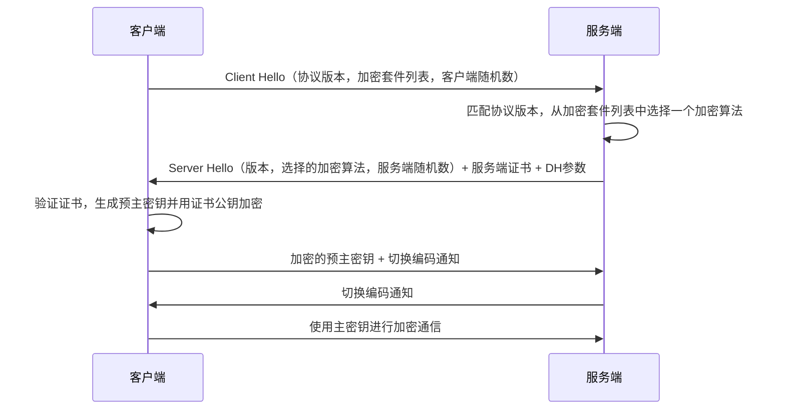

# HTTP

全称超文本传输协议。

在HTTP/2之前，HTTP协议是基于纯ascii码文本传输。HTTP 1.0是一个TCP链接一个HTTP请求，HTTP 1.1实现了流水线，允许建立一个TCP链接后发送多个HTTP请求

如果用户请求中的数据出现在响应头中，就会发生**HTTP消息头注入**，也就是**CRLF注入**。因为响应头是通过\r\n分割，因此可以注入。比如Location头重定向到恶意网站，Set-Cookie头使用指定cookie造成固定会话攻击等等。

HTTP/2使用了二进制分帧层，不再以纯文本形式传输，因此可以实现多路复用。HTTP/2定义了5种伪头，比如`:authority`等于HOST头。除了五种伪头之外，其他都叫常规的头，存在于伪头之后。

常用的HTTP头有固定的编号，称为静态映射表。传编号节约带宽，值重复就不传值，只传编号。HTTP/2协议本身虽然不要求使用TLS加密，但是主流浏览器普通要求在使用HTTP/2的时候使用TLS

HTTP/3 最大的改变是使用基于UDP的QUIC协议，省去了TCP三次握手。UDP本身存在反射攻击的问题（DDOS），这个问题只能缓解。注意HTTP/3第一次加密连接省去不了TLS握手，但是从第二次加密连接开始就可以实现“0-RTT”。在第一个数据包包含HTTP请求。

# SSL/TLS

## 概述

注意这里的主密钥是预主密钥加Hello中的两个随机数。同时这不是一个完整的DH密钥交换，因为客户端没有发送自己的密钥参数，而是直接生成预主密钥并且加密发送。TLS使用了公钥密码体系（证书）实现了服务端的可认证性，并使用对称密码体系加密信息（通常是流密码或者CBC模式的分组密码），好处是计算快。

## 漏洞

TLS1.0存在**BEAST攻击**。

所有TLS版本都存在另一个漏洞：CRIME。原理是在HTTPS中在TLS层启用的请求数据压缩算法有一个特性：原始数据存在相同内容的时候，压缩后的数据长度更短。攻击者后再携带不同参数的URL让受害者的浏览器不断发出请求，然后监听网络流量大小，推测出敏感数据（比如Cookie中的SessionID）

解决办法就是禁用请求数据压缩，实际上也是这么干的。HTTP/2则无所谓，因为它使用哈夫曼编码，不存在这个问题。

TLS1.2之前还有一个问题：第一个Client Hello包不可能加密，它是明文的。其中包含了一个算法套件列表，这其中可能包含一些已经不安全的算法。攻击者截取这个明文包，只保留算法套件列表中不安全的算法，实现**SSL/TLS密码套件降级攻击**。解决方法就是服务端禁用不安全的算法。

## TLS1.3

TLS1.3是一个重大变化：

1. 删除大量不安全比必要的选项，限定算法，不用协商
2. 舍弃交换密钥中RSA的参与，完全依赖于DH（及其变体）密钥交换

因此Client Hello  +   Server  Hello,一个RTT即可生成会话密钥，然后进行加密通信。交换密钥中RSA的参与还有一个问题，不具备前向保密性。一旦私钥泄露，以往所有的消息记录都可以解密。

# HTTPS

就是HTTP over TLS，使用TLS提供的加密服务加密HTTP会话，一般在443端口。

当网站要求https，而用户以http访问的时候，响应会是一个重定向，状态码301或者302，包含一个Location头，其中指明重定向到https协议。

这里存在问题了，这第一个数据包是明文的，攻击者可以劫持数据包，替代用户和服务器建立一个正常的HTTPS连接。因为是自己建立的连接，攻击者是可以解密的，把解密的明文以HTTP返回给用户，用户以为一直在访问HTTP网站，察觉不到异常，攻击者就实现了窃听

这被称为HTTP降级攻击（SSL/TLS stripping）

如何解决？HTSP（HTTP Strict Transport）协议诞生，服务端响应加入一个HSTS头，指明接下来多少时间都要用HTTPS访问网站，这样即使你输入http，浏览器也会自动切换到https协议

但是第一次访问还是明文的，攻击者可以删除HSTS头，然后继续stripping。这可以使用预加载列表，依赖浏览器预先准备需要HTTPS访问的网站的列表，而不依赖服务器响应中的HSTS头添加。

# WebSocket

当web页面遇到以下情况：实时股价显示，游戏，聊天。这些都需要客户端和服务端频繁交互，但是传统HTTP是半双工的，基于请求-应答模型，服务器无法主动发送消息。

要实时更新页面内容，传统方法是使用AJAX轮询。也就是以固定的时间间隔不断通过fetch api 或者XHR 发送HTTP请求，询问是否有新数据。这样的缺点很明显，效率极低，时效性差（基于间隔）

于是有了长轮询的优化，长轮询不按照固定的时间间隔，而是模拟事件驱动异步处理，服务端收到请求后挂起，数据更新后再响应，客户端收到响应后再发起下一个请求。这样依旧存在缺点：实现复杂，挂起请求占用服务器资源。

于是一个全新的协议websocket就诞生了，websocket是真正的全双工通信，客户端和服务端都可以随时向对方发送数据。客户端发送一个升级到Websocket的“握手请求”（HTTP），然后服务端响应。接下来正式开始websocket协议的通信。注意websocket和HTTP一样，本身是不加密的。安全一样依赖于传输层安全协议，也就是TLS协议。

WebSocket的**跨域访问策略**不同HTTP的CORS，它没有历史包袱。只通过服务端来校验发起源是否合法。

# web服务器

web服务器本身作用就是通过HTTP/HTTPS提供服务。它会把资源分成两类：**动态资源**和**静态资源**

静态资源比如图片，静态html文档，是服务器上已经存在的，缓存好的。你请求我就立马返回。

动态资源需要用过计算，根据用户不同，时间不同等因素返回不同结果。

动态资源如何处理？

1. 最早是使用**CGI**（通用网关接口），这是一个古老的协议，定义web服务器如何与 后端程序（C/Python/php）交换数据。收到一个请求后，niginx（服务器）启动一个新进程，通过CGI协议船体HTTP请求中的参数，进程运行对应语言的程序处理业务，返回结果。
2. 然后出现了FastCGI。CGI的缺点是不断创建销毁进程，开销太高。FashCGI相当于一个进程池模型，它先启动一个常驻的，独立的进程管理器（最知名的php-fpm），它预先启动一批进程，也就是建立一个进程池，然后分配任务给空闲的进程。
3. 语言专用的继承模块。比如Aphache `mod_php`   Java Servlet   这都是“内置“的

动态资源的返回还有两种选择：

1. 返回完整的html文件，html中的动态资源在服务端（后端）组装好（模板引擎渲染）。这也是传统MVC架构，渲染就是V的部分。
2. 返回json数据，前端通过api调用（Restful api标准）（XHR，fetch）获得的想要的动态资源的json数据，然后通过前端的语言（javascript）的模板引擎（Vue中的）进行渲染展示。这相当于把MVC的V剥离了放在了前端。

第二种就是我们常说的前后端分离架构。一个HTML页面往往只有部分会变化，按照1中的传统方式就要重新请求整个html。但是按照2中只需要请求变化部分的数据，然后前端渲染替换即可。这也就是我们常说的**AJAX**，也就是**异步的JavaScript 和 XML**

# 反向代理

正向代理是靠近客户端，替客户端发送HTTP请求；反向代理靠近服务端，替服务端响应请求

CDN可以作为反向代理服务器，常用它缓存静态资源

nginx也可以作为反向代理服务器，缓存静态资源并且转发动态资源请求。后端的服务器可能不止一台，而是一个服务器集群。通过URL路径的不同转发到不同的后端服务器上，接受响应并返回。

不同语言的后端实现有自己的模型。php最常见就是使用php-fpm（FastCGI Process Manager）分配进程执行php脚本；java不使用遵循CGI协议的CGI程序，而是用内置的Servlet包写的JAVA Serlvet程序，运行在Servlet容器中（Tomcat）；Python则通过ASGI（异步，比如FastAPI框架）或者WSGI（同步，比如Flask框架）实现服务器和python程序的通信，这相当于java的Servlet规范。ASGI/WSGI服务器就相当于servlet容器Tomcat

这也可以看出来php和java，python的不同。php天生就是为了WEB而生，而java/python是“在WEB上使用”。

php只需要遵循简单的CGI约定处理请求的参数，自己处理业务逻辑生成动态资源；java为了处理WEB请求使用Servlet规范；python早期也是用CGI，现代则使用WSGI或者ASGI。

# 同源策略

## 概述

同源策略是前端安全的基石，讲到Web安全就离不开同源策略。

用几个问题深入理解同源策略：

1. 什么是同源？源是指`protocal,host,port`三元组，也就是同协议，主机和端口。
2. 同源策略干了什么？阻止不同源的页面通过javascript读取对方数据。
3. 同源策略在放谁？防的是恶意网站，防止恶意网站读取用户在当前网站的数据。
4. 谁在执行同源策略？浏览器，浏览器是同源策略的执行者。同时浏览器底层使用了进程沙箱，确保不同站点的页面放置在不同的页面渲染，这是物理层面的隔离，也是同源策略的最后一道防线。即使攻击者想办法绕过了同源策略，也无法读取其他网站的数据。

同源策略并不是专门防御哪个漏洞而产生的，它是整个前端安全的基石。在当时背景下，web的复杂性增加，javascript的功能越发强大。如果不对javascript进行限制，恶意网站可以”为所欲为“。所以本质上来说同源策略就是浏览器对js代码能力的限制，具体有以下方面：

1. **DOM访问**：限制来自不同源的JavaScript对当前页面的DOM进行读写。
2. **数据存储访问**：限制不同源的页面访问彼此的Cookie、LocalStorage等数据。
3. **网络请求**：限制不同源的JavaScript代码读取来自其他源的网络请求的响应内容。

同源策略有两个缺陷，分别催生了XSS和CSRF：

1：同源策略只限制了跨域读取资源，并没有限制跨域加载资源。XSS正是利用src属性的跨域加载js代码能力，让浏览器认为恶意js代码来自本网站。解析）

2：恶意网站发起访问本网站的请求时，同源策略的执行上没有拦截请求，而是拦截响应。浏览器发现A网站收到的响应中写明是B网站的响应，就进行拦截。但是请求已经发送了，可能会造成副作用，这也就是CSRF。

## 跨域访问方法

很多时候是有跨越访问需求的，我们分为两种

一、前端之间跨域访问

不标准做法：

1. 通过修改两个页面的document.domain属性到一致，因为同源策略允许子域名应用相互访问
2. window.name跨越。window.name是窗口的名称，当窗口发生跳转的时候，这个值不会改变。A要访问B中的数据时候，B把数据放在window.name中，然后A通过iframe加载B，B在通过iframe回到A，此时就带上了window.name中的数据。

标准做法：

通过window.postMessage发送消息。这是现代浏览器安全且标准的跨域访问方法，它专门设计用来在不同源的窗口、iframe、标签页或Worker之间安全地传递数据。

二、前端跨域访问服务端

不标准的做法：

JSONP   JSON with Padding   因为跨域加载js代码不受同源策略限制，服务端把要传递的JSON数据包装成javascript代码，比如返回响应内容为`callback({"name":"orange"})`，注意要设置返回类型为js代码。即`Content-Type: application/javascript`。这样前端拿到后直接执行这个预先定义好的js函数，比如在前端定义这个函数直接`console.log`打印参数。我们就成功跨域拿到了数据。这不是标准做法，只算一个技巧

标准做法：

通过CORS方案，也就是Cross-Origin-Resource-Sharing，跨域资源共享。浏览器在请求中带上Origin头指示当前的源，服务端返回Acess-Control-Allow-Origin头指明那些源可以访问自己。CORS讲请求分为两类：简单请求和复杂请求。简单请求就是GET和POST，复杂请求就是PUT，DELETE等。它规定简单请求可以直接发送，而复杂请求需要通过OPTIONS方法预检，询问服务器是否允许这种请求方式。很显然，对于简单请求，不论源是否在服务器的允许源中，请求都已经发出并且产生了作用，这就给CSRF钻了空子。

如果规定所有请求都要通过OPTIONS预检，由服务端判断请求是否安全，不就可以防御CSRF吗？CSRF攻击能形成的本质就是恶意网站在用户**不知情**时向正常网站服务器发送了带有**副作用**的请求，即使同源策略限制恶意网站读取响应也无济于事。那为什么不这样做呢？

实际上CORS解决的跨域共享问题和CSRF的跨域读取问题很像，前者跨域读，后者跨域写。这本来就是可以用一个统一的跨域访问策略实现，CORS的复杂请求就是很好的例子。而之所以保留简单请求这个”空子“，这其中有**历史原因**在（《白帽子讲WEB安全》）。CORS标准提出的很晚，它无法约束通过HTML原生表单就能发送的请求，而GET和POST又不可能废弃。因此CORS只得划分了简单请求一类。简单请求的定义其实就是”HTML本身就能发出的请求“。HTML涉及早期只考虑了GET和POST的场景，因此也只**原生支持**GET和POST。

WebSocket就是很好的例子，它不是基于原本的HTTP，而是一个全新的协议。因此它的跨域访问策略就设计的很好，完全由服务端校验发起源是否合法。具体是在建立连接的HTTP握手阶段就校验HTTP握手请求中的Origin头，不是合法源就直接拒绝连接。

# Cookie

cookie本身是为了解决HTTP协议无状态的问题而诞生。HTTP协议本身不记录状态，而web服务又需要记住不同用户，因此才有了cookie。Cookie最大的问题是存储在客户端中，很容易被查看和篡改，甚至早期很多密码都是明文存在Cookie中的。因此诞生了Session，把敏感信息存在服务端数据库中，仅仅在Cookie中存放SessionID用于查询Session。但是服务端存大量Session会占用服务器资源。因此又出现了JWT，签个名放在客户端的Cookie中。注意JWT本身是不加密，只签名防止篡改，不能存放敏感信息，有加密版本叫JWE。JWT的坏处是签发之后服务端无法主动吊销，因此要加入一个存活时间。

Cookie，Session，JWT的关系和各自的作用就将清楚了，接下来讲 Cookie的属性。

在Web安全中，Cookie相当于服务端颁发的身份令牌，有了cookie不需要账户和密码就能登录，因此Cookie安全至关重要。Cookie的每个属性基本都和安全相关。

1. Domain     不指定时为Host-Only cookie只在当前域名生效       只要指定就对子域名生效
2. Path          指定cookie生效的路径      但是不同路径下的页面是同源的，可以互相读取cookie
3. Expires    指定有效期，不显示指定就是临时cookie，浏览器关就删除
4. **HttpOnly属性**    只用于HTTP/HTTPS传输，客户端的javascript无法读取（缓解XSS）
5. Secure       只能在HTTPS请求发
6. Samesite：（一定程度缓解CSRF）
   None：任何场景都发送，但是带上Secure属性
   LAX：普通跨站请求不发送，但是导航发送
   Strict：任何情况都不发送（影响体验）

为了安全，重要的Cookie要设置Secure属性。如果未设置，通过HTTP跳转到HTTPS时，第一个明文数据包就会泄露cookie。HttpOnly属性为了减少XSS攻击基本是必须设置的。在不需要子域名读取Cookie的时候就不要设置Domain。会话有关的Cookie建议设置SameSite为LAX，可以减少CSRF攻击。

为了约束Cookie的属性，出现了”Cookie前缀方案“

1. _HOST-: 带有Secure并且是HTTPS    不包含Domain   Path为’/‘
2. _Secure-: 带有Secure并且是HTTPS

**固定会话攻击**：攻击者诱导用户使用一个固定的SessionID。（比如早时一些应用允许通过URL的参数指定SessionID）

## DNS

### 服务器类型

分为递归查询和迭代查询，区别是谁在查询

1. DNS解析器（本地DNS服务器）    由IPS提供，接受用户请求并执行
2. 根域名服务器
3. 顶级域名服务器
4. 权威域名服务器

### 记录类型

- **A记录**：将域名指向一个IPv4地址。
- **AAAA记录**：将域名指向一个IPv6地址。
- **CNAME记录**：别名记录，将一个域名指向另一个域名。     **和CDN相关**
- **MX记录**：邮件交换记录，指定负责接收邮件的服务器。
- **TXT记录**：文本记录，常用于域名所有权验证、SPF反垃圾邮件等。
- **NS记录**：指定该域名由哪个DNS服务器来进行解析。

### 缓存

一次DNS查询的缓存检查顺序，遵循一个高效的“由近及远”的链条：

1. **浏览器缓存** → 最快，但范围仅限该浏览器。找不到就交给主机
2. **操作系统缓存 & `hosts` 文件** → 系统级，为所有应用服务。
3. **路由器缓存** → 家庭或局域网级，所有连接到该路由器的设备共享。
4. **ISP递归解析器缓存** → 规模最大，为所有使用该ISP的用户服务。
5. 若以上均未命中，则启动完整的**递归/迭代DNS查询**过程。

## CDN

CDN：Content Delivery Network   内容分发网络

访问baidu.com时，DNS会有一条**CNAME记录**跳转到a.shifen.com

这里a开头的域名就是CDN域名。

CDN是由商家在各地搭建的服务器，**提前**拉取顾客的服务器的静态内容（源码）并对外分发

动态内容根据用户不同或者时间不同而改变，若是通过CDN服务器再访问百度的服务器就达不到加速的功能

也有能分发动态内容的CDN

CDN相当于代理服务器，是一面墙，可以缓解DDOS攻击

**CDN被DDOS攻击怎么办？**

通过**任播**技术进行**负载均衡**

任播：

- **多个**分布在不同地理位置的服务器**共享同一个IP地址**。
- 网络路由器会根据动态的路由协议（主要是**BGP**），将发送到该IP地址的数据包**路由到“最近”的一台服务器**。
- 这里的“最近”通常指的是**网络拓扑上的最近**（跳数最少、延迟最低），而不一定是物理距离上的最近

# IDS、IPS、防火墙

防火墙是第一道防线，相当于门，工作在网络层和传输层。根据IP地址，端口，协议进行过滤

1. 包过滤防火墙
2. 状态检测防火墙

IDS设置在**旁路**，只负责警报并记录日志     HIDS      NIDS        snort

IPS串联在主线路（**在线部署**）可以丢弃恶意数据包    snort-inline

# 认证authentication

这里的认证主要是Web应用中用户向服务端证明身份，不是windows域内。

主要介绍以下：

## 一：HTTP认证

客户端未携带认证信息的时候，服务端返回401响应，包含一个`WWW-Authorization`(为啥是授权)头，指明用哪种HTTP认证方法，客户端把认证信息放在`Authorization`头提交

1. Basic认证：直接把账号密码Base64编码放在`Authorization`头。理论上必须配合HTTPS
2. Digest认证：类似NTLM认证，是一个**挑战-应答**协议。服务器给随机nonce值，客户端计算正确哈希作为“应答”。
3. Bearer认证：在`Authorization`头放一个Token进行认证，常用JWT

## 二：表单登录

最常见的认证方式。就是用户名+密码，注意点：

1. 服务端不要存密码明文，而应该存**加盐hash**。案例有CSDN密码泄露，Rockyou密码泄露
2. 密码安全策略，规定最小长度，有效期，需包含特殊字符等等

一般第一次登录服务端会使用`Set-Cookie`植入Cookie，后续依赖Cookie。

要防御SQl注入，CSRF等攻击。

# 授权authorization

## 访问控制模型

1. DAC
2. MAC
3. RBAC
4. ABAC

主体         客体            访问权

访问控制矩阵          访问控制表（描述客体）            访问能力表（描述主体）

## 访问越权

1. 垂直访问越权：MFC实验里面的，不是管理员就返回中隐藏管理按钮，有种掩耳盗铃的感觉。这也叫“菜单级别的访问控制”。
2. 水平访问越权：比如通过uid区分不同用户的信息，通过手动修改uid访问了其他用户的数据

## 零信任模型

揭穿传统内网安全的“信任泛滥”问题

1. 显式认证，从不信任：内网也要认证授权。
2. 遵循**最小权限**原则：仅仅授予用户能完成目标任务的最小权限。当权限不需要时及时撤销。
3. 敌情想定：假设攻击者已经在内网环境中，要控制其的横向移动范围。

# HMAC算法

HMAC算法的数学公式为：

HMAC(k, m) = H(k' ⊕ opad, H(k' ⊕ ipad, m))

其中：

- **H** 是密码散列函数（如MD5或SHA-2）。
- **k** 是密钥。
- **m** 是要认证的消息。
- **k'** 是从原始密钥k导出的另一个密钥（如果k短于散列函数的输入块大小，则向右填充零；如果比该块大小更长，则对k进行散列）。
- **ipad** 是内部填充（0x5C5C5C…5C5C）。
- **opad** 是外部填充（0x363636…3636）。