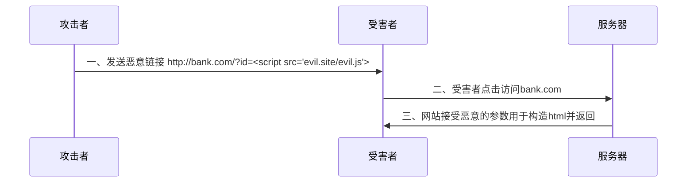

# 一、什么是XSS

XSS的英文全称是Cross-Site-Scripting    本来缩写是CSS，为了区别于层叠样式表缩写为XSS

**本质**：javascript代码注入

因为同源策略的限制，恶意网站的代码无法读取用户在其他网站的数据，于是就将代码**注入**到目标网站中。

**注入原理**：**服务器**将恶意代码用于**构造html**页面并直接返回

广义上所有js代码注入都算XSS，所以利用js模板引擎（Vue.js）的注入也算（类比SSTI）

# 二、XSS的分类

## 反射型XSS



浏览器认为这段加载evil.js的js代码来自服务端。而同源策略是允许跨域加载js代码（加载完就当本页面代码执行了，因此不受同源策略限制）。因从攻击者的evil.js文件就被加载执行了。也可以直接内联执行

## 存储型XSS

攻击者通过发表博客或评论等方式向服务器数据库插入恶意代码，每次有受害者浏览，服务端就会返回带有恶意代码的html页面

## DOM型XSS

- **反射型XSS**：恶意代码由**服务器**返回并**在服务器返回的响应体中**执行。
- **DOM型XSS**：恶意代码由**前端JavaScript**写入并**在DOM解析过程中**执行。

DOM型是前端的锅，前端的JS代码拼接了恶意代码，反射型是服务器拼接的（区别看谁干了）

比如前端代码如下：

```javascript
// 从URL的hash中获取用户名，然后用innerHTML直接写入页面（**错误做法**）
var username = location.hash.substring(1); // 去掉'#'号
document.getElementById('welcome-message').innerHTML = "Hello, " + username;
```

构造恶意url：

`https://example.com/welcome#`

# 如何攻击

最简单就是发送document.cookie获取cookie

也可以通过构造GET、POST请求来进行一些操作比如上传或者删除数据（请求被当作客户端的操作，攻击者不需要知道cookie，浏览器发送请求会自动带上cookie，类比CSRF）

复杂payload可以利用xss平台 （BeEF，蓝莲花等）

# 绕过技巧

常用靶场xss-labs，github地址：https://github.com/do0dl3/xss-labs

网上有很多搭建好的，比如：https://xssjs.com/yx/

总结如下：

- 双写，编码，拼接（所有注入类型都能用到）
- 使用javascript伪协议 
- 使用各种事件处理程序 如onclick等
- 尝试各种标签和属性

# 防御

## HttpOnly

这个属性在 `web复习.md`中介绍过。服务器Set-Cookie的时候写入这个属性，客户端就无法读取cookie了，cookie只能用于HTTP/HTTPS传输。

## 输入过滤

直接将黑名单中的代码过滤掉

缺点：

1. 富文本场景，比如技术论坛，就是需要打`<script>` 
2. 破坏展示。比如对引号转义，导致输出所有引号变成`\"`

早期火狐的**XSS-Filter**      谷歌**XSS-Auditor**都是对url的参数进行过滤（因此也只针对反射型）

## 输出转义

防御XSS攻击的标准方案，很多服务器模板引擎（jinjia2）都内置了很多过滤器

根据被输出到html页面中还是javascript代码中进行html转义或者javascript转义

html属性标签的时间处理程序中，先js转义，再html转义（客户端优先解析html）

**在DOM型XSS中**，注意是前端负责转义，当然更好的规范操作，避免直接使用innerHTML

## Content-Type问题

比如JSONP中，就是要设置content-type为javascript，而正常JSON数据如果content-type不对也会被当html或者js代码执行

## CSP

全称Content-Security-Policy  内容安全策略

服务端发送Content-Security-Policy消息头指明可以加载js代码的域

和CORS思想相同，由服务器告诉**浏览器**哪些域的JS代码是安全的。它实际上可以**看作对CORS的补充**

CORS告诉浏览器哪些域能访问服务器，CSP告诉浏览器哪些域的js代码可以安全加载

缺点：

1. 开启CSP就会完全禁用内联js代码，所有js代码都必须通过外部资源嵌入
2. 外部资源太复杂了，维护成本高
3. 已有的web应用改造成本高

## 总结

CSP是最符合安全思想的，但是成本高。早期使用XSS-Filter，XSS-Auditor等，现在输出转义是主流。