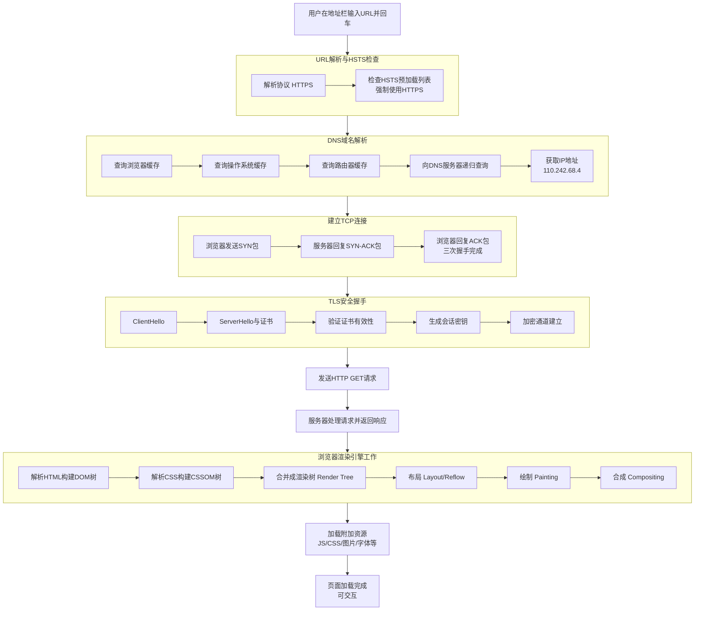

# 在你访问baidu.com的时候，浏览器做了什么？

总流程图：

```mermaid
flowchart TD
A[用户在地址栏输入URL并回车] --> B[URL解析与HSTS检查]

subgraph B [URL解析与HSTS检查]
    direction LR
    B1[解析协议 HTTPS] --> B2[检查HSTS预加载列表<br>强制使用HTTPS]
end

B --> C

subgraph C [DNS域名解析]
    C1[查询浏览器缓存] --> C2[查询操作系统缓存]
    C2 --> C3[查询路由器缓存]
    C3 --> C4[向DNS服务器递归查询]
    C4 --> C5[获取IP地址<br>110.242.68.4]
end

C --> D

subgraph D [建立TCP连接]
    D1[浏览器发送SYN包] --> D2[服务器回复SYN-ACK包]
    D2 --> D3[浏览器回复ACK包<br>三次握手完成]
end

D --> E

subgraph E [TLS安全握手]
    E1[ClientHello] --> E2[ServerHello与证书]
    E2 --> E3[验证证书有效性]
    E3 --> E4[生成会话密钥]
    E4 --> E5[加密通道建立]
end

E --> F[发送HTTP GET请求]
F --> G[服务器处理请求并返回响应]
G --> H

subgraph H [浏览器渲染引擎工作]
    H1[解析HTML构建DOM树]
    H2[解析CSS构建CSSOM树]
    H3[合并成渲染树 Render Tree]
    H4[布局 Layout/Reflow]
    H5[绘制 Painting]
    H6[合成 Compositing]
    
    H1 --> H2 --> H3 --> H4 --> H5 --> H6
end

H --> I[加载附加资源<br>JS/CSS/图片/字体等]
I --> J[页面加载完成<br>可交互]
```

