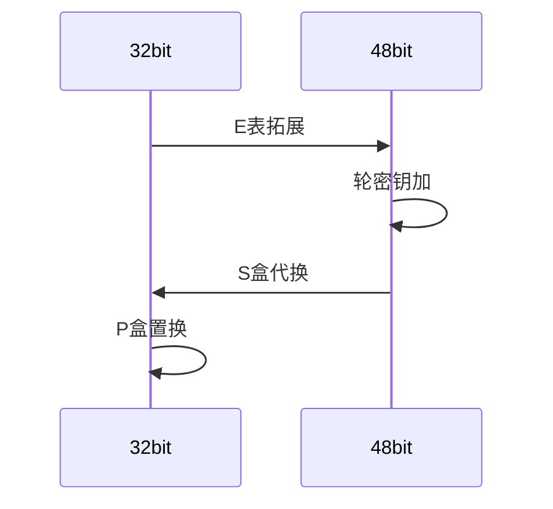

昨晚八点睡觉，中间醒了两次睡到十二点办，实在睡不着，辗转反侧到三点多，终于睡着到早上七点半。索性今早起床还算清醒，但是昨晚的梦好像周围人都在前进，只有自己还踌躇在原地。醒来有种失去了什么的感觉，说不出的难受。但是时间不会偏爱，它依旧不差分秒地流逝。努力学习吧，至少给自己一个交代。

# 一：密码学

## 1：概述

密码算法按**用途**大致三类：

1. 加密算法：提供**机密性**
2. Hash函数：提供**完整性**
3. 数字签名：提供**认证性**和**不可否认性**

其他分类就是对称、非对称  ；流密码，分组密码等等

密码体制地安全性仅依赖于对**密钥**地保密，而不依赖于**算法**的保密

攻击：

穷举（最常用）  统计分析（古典密码常见） 数学分析（差分分析）

| 类型         | 已知信息               |
| ------------ | ---------------------- |
| 唯密文攻击   | 密文                   |
| 已知明文攻击 | 明密文对               |
| 选择明文攻击 | 选择的明文->对应的密文 |
| 选择密文攻击 | 选择的密文->对应的明文 |

攻击强度从上到下增强

## 2：古典密码

主要是       **代换密码**和**置换密码**

代换有单表代换（凯撒密码，放射密码）多表代换（维吉尼亚密码）

置换就是易位，原本的字母不变。

## 3：流密码（序列密码）

现代流密码起源于**一次一密**密码，要求密钥至少与明文长度一样长，密钥随机产生且只使用一次。

现在流密码使用**密钥k**通过**密钥流发生器**生成密钥流，然后**逐位**对明文加密。一般是进行**异或**运算。

同步流密码和自同步流密码：密钥生成和明文字符无关的是同步流密码。此时密文字符**不依赖于此前的明文字符**

密钥流发生器：

核心是**线性反馈移位寄存器**(n个寄存器和1个反馈函数)

**游程**和**Golomb随机性公设**

m序列性质：周期达到最大值2^n-1的序列就是m序列，它满足Golomb随机性公设

为什么最大值是2^n-1？每个状态输出1位，最多是2^n种状态，然后排除全0

标准流密码算法有**A5/1**和**RC4**

## 4：分组密码

设计原则：通过代换进行混淆，置换进行扩散

**混淆**是使密钥和密文之间的关系尽可能模糊，不能从密文的统计特性推测密钥

**扩散**是使明密文之间的关系尽可能复杂，密文的每一位要受明文中的多位影响。

迭代方式有两种：

1. SP网络     代表AES
2. Feistel网络   代表DES

### DES

迭代16轮，分组64bit   密钥64bit（有效56bit+8bit校验） 子密钥48bit

重点是轮函数中bit数的变化：

然后就是填充，最常用的就是PKCS7。最后一个分组差几个字节，就在剩余的每个字节填几

注意**padding Oracle攻击**（CBC模式）

然后是子密钥生成。密钥的有效长度是**56bit**分为28+28每组进行循环左移，然后通过PC-2到**48bit**

### AES

1. 明文密文分组长度：128bit
2. 密钥长度：128/192/256bit
3. 迭代轮数：10/12/14轮
4. 子密钥长度：128bit

具体实现不用看

### 分组密码工作模式

ECB   CBC  CFB   OFB   CTR

## 5：哈希函数

也称为报文摘要函数，**单向**散列函数

攻击者知道hash算法，目标是找到一对或更多对的碰撞消息。

生日攻击

差分分析（模差分），分析特定明文差对密文差的影响

## 6：公钥密码

传统密码  密钥管理困难，需要安全信道，无法签名

公钥密码  密钥管理简单，但是计算量大

主要就是RSA，剩下不用看

公钥密码的本质是找单向陷门函数，知道陷门就可以逆计算输入

## 总结

密码学的基础是数论。很多细节方面的东西都要涉及到数论中的内容了，比如原根，比如同余等等。面试官肯定不会问这么细，他自己工作多年不可能记得。那主要就是一些宏观上的概念，和与安全相关的应用方面的问题。

可能会问分组密码工作模式，在一些协议中的应用。公钥密码应该是重点，因为应用更多。建议到时候还是刷面经为主，看怎么问

# 二：数据结构与算法

这其实是我本人比较不想面对的部分。从笔试部分来看应该不是重点，但是怕他问啊，看看概念的一些东西。

# 三：计网安

这个课很好的补充了一些概念。iuest粗略过一遍

# 四：计算机网络

重点

RIP基于UDP 端口520

OSPF基于IP  端口89

BGP基于TCP  179

VPN  NAT  IPSec

**DNS**  DHCP
